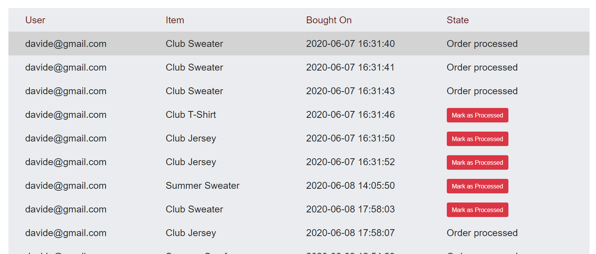
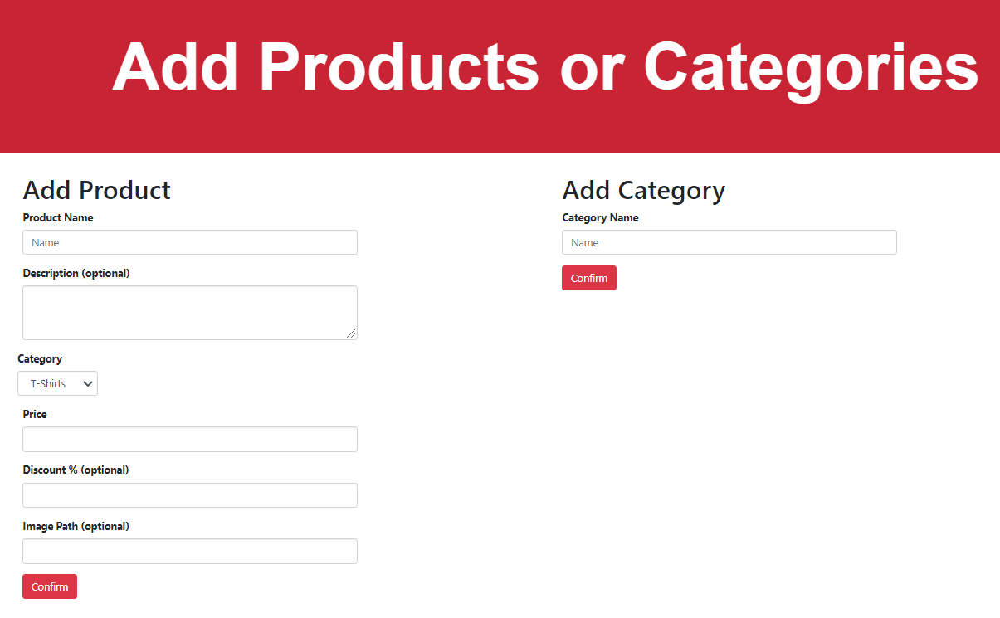

# UOBVolleyball Website Showcase

<p align="center">
</p>

# Login system

<p align="center">
</p>

The user is able to register and login, basic validity checks are made on the input and the data is then either stored or verified against the SQLite database. Dynamic flash messages are used to commincate with the user. 

<p align="center">
</p>

# Dynamic Shop Page

<p align="center">
</p>

Once logged in, the user is able to search for items and make purchases from the Shop page. Products are pulled from the SQLite database and displayed dynamically based on the order and filters selected by the user. 

# Admin Dashboard

If the user logs in on an account which has admin access, the admin dashboard webpages are shown in the navbar.

<p align="center">
</p>

In those pages an Admin is able to do multiple things: Get an overview of all the current registered users and set them as Admin [Img 1], get an overview of all the orders and mark them as processed (once the item is physically sent to the buyer) [Img 2], and add new products or product categories [Img 3].

<p align="center">
</p>


## Usage 
```
$ npm start
```
Visit http(s)://localhost:8081/ to view the website.

Admin login details:

```
email: davide@gmail.com
password: davide
```

## Built With 
[Bootsrap](https://github.com/topics/bootstrap) | [Handlebars](https://github.com/handlebars-lang/handlebars.js)  | [Express](https://github.com/topics/express)  | [SQLite](https://www.sqlite.org/index.html)

## Additional Info
Signup/Login system uses a SQLite3 database to store and look-up user data, flash messages are used to notify
a user of whether they have registered, have logged in, have logged out or some mistake occured during the process
such as a password mismatch or the email not being in our database. Password is securely hashed using bcrypt.
